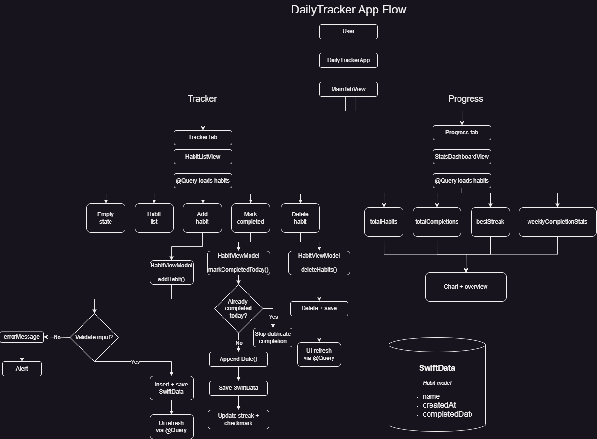

# DailyTracker

DailyTracker is a simple iOS habit tracking app built with SwiftUI and SwiftData.

## Features

- Add new habits
- Delete habits with swipe actions
- Mark habits as completed for today
- Prevent duplicate completions on the same day
- Show current streak for each habit
- Show validation errors when input is empty
- Save data locally with SwiftData
- View progress statistics in a separate tab
- Display weekly completions with SwiftUI Charts

## Tech Stack

- Swift
- SwiftUI
- SwiftData
- SwiftUI Charts
- MVVM-style structure

## App Flow

