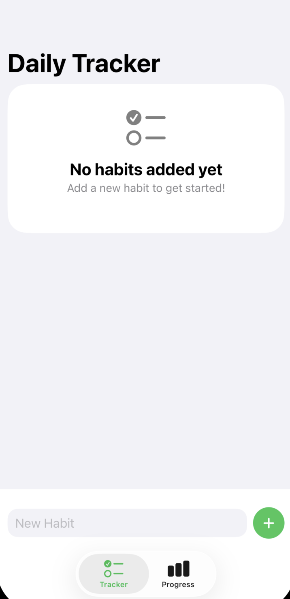
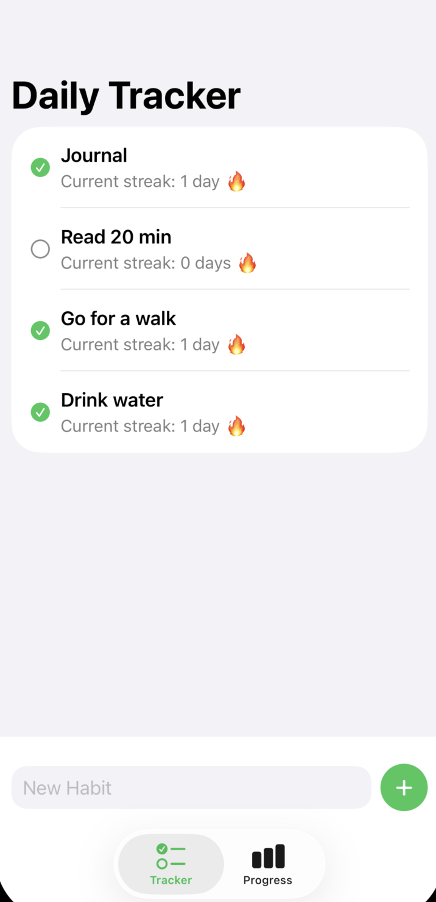
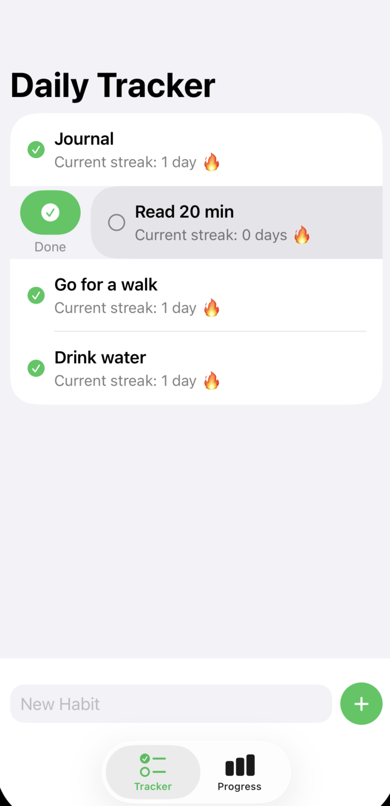
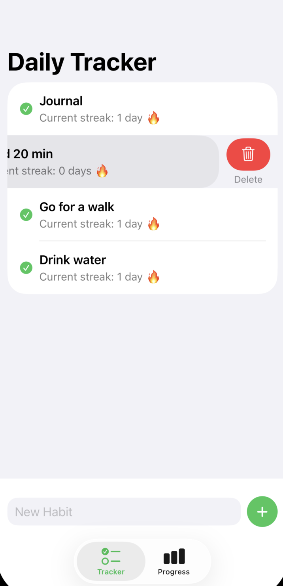
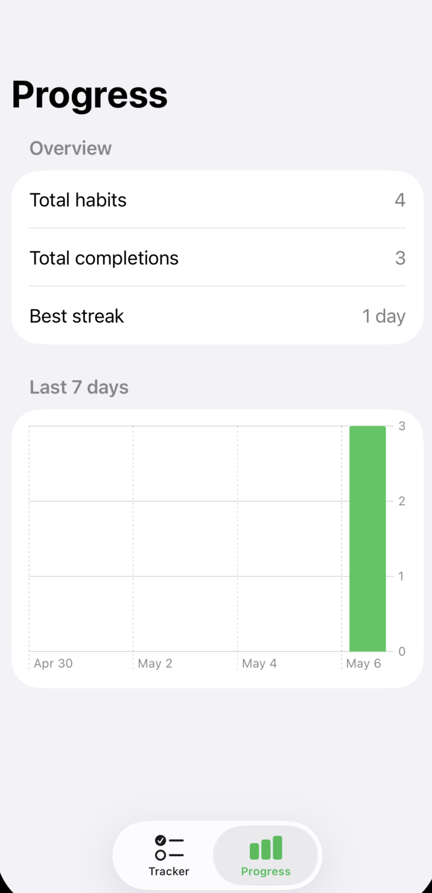
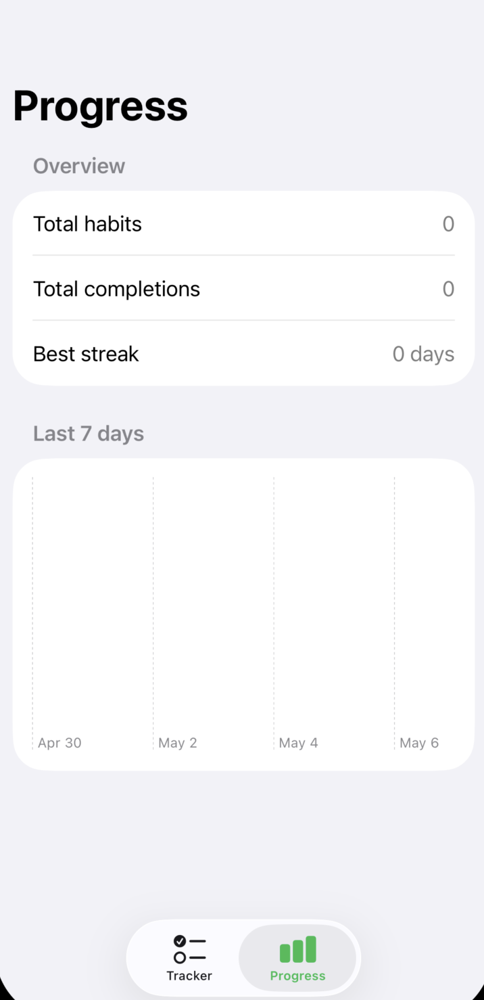

# DailyTracker

DailyTracker is a simple iOS habit tracking app built with SwiftUI and SwiftData.

## Features

- Add new habits
- Delete habits with swipe actions
- Mark habits as completed for today
- Prevent duplicate completions on the same day
- Show current streak for each habit
- Show validation errors when input is empty
- Save data locally with SwiftData
- View progress statistics in a separate tab
- Display weekly completions with SwiftUI Charts

## Tech Stack

- Swift
- SwiftUI
- SwiftData
- SwiftUI Charts
- MVVM-style structure

## App Flow

## Screenshots

<table>
  <tr>
    <td align="center">
      <strong>Tracker empty state</strong> 
      
    </td>
    <td align="center">
      <strong>Tracker habit list</strong> 
      
    </td>
  </tr>
  <tr>
    <td align="center">
      <strong>Swipe to complete</strong> 
      
    </td>
    <td align="center">
      <strong>Swipe to delete</strong> 
      
    </td>
  </tr>
  <tr>
    <td align="center">
      <strong>Progress dashboard</strong> 
      
    </td>
    <td align="center">
      <strong>Progress empty state</strong> 
      
    </td>
  </tr>
</table>